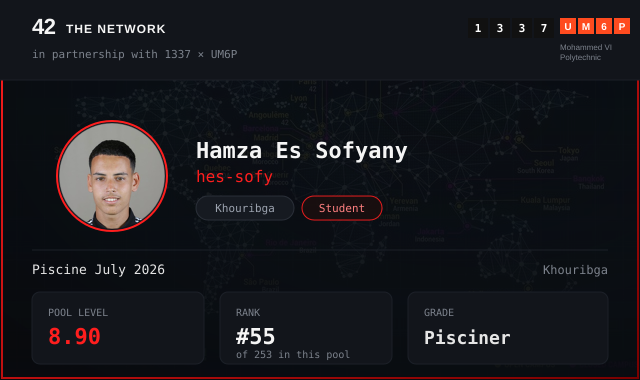

# Hi there, I'm Hamza Es-Sofyany 👋

## 🚀 About Me
- 🎓 Software Engineering Student at **1337 School** (42 Network)
- 💻 Passionate about C, Python, JavaScript & TypeScript
- 🌱 Currently learning: Low-level programming & Web Development
- 📍 Tiznit, Morocco

## 🛠️ Languages & Tools

## 📊 GitHub Stats

## 📫 Connect with me

# 👋 Hamza Es-Sofyany | 1337 School (42 Network)
> 🏊 Currently surviving the **Piscine** @ 1337 Khouribga 🔴

  

<text x="424" y="344" font-family="monospace" font-size="18" font-weight="bold" fill="#e6e6e6">Pisciner</text>
</svg>

